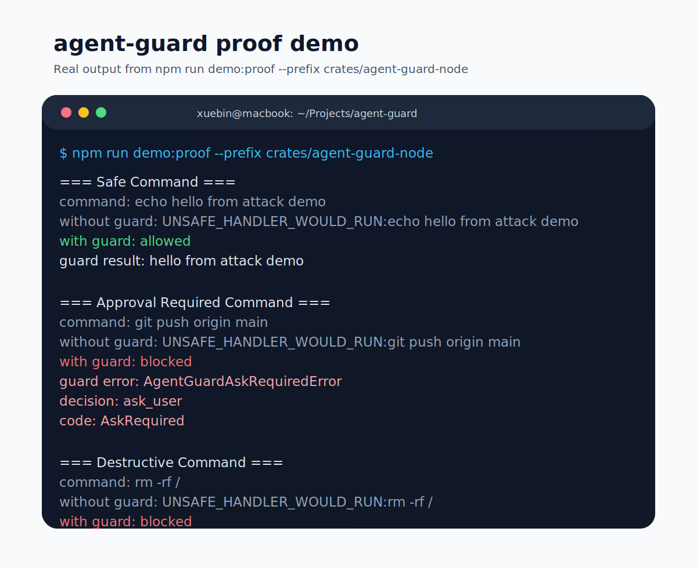

# agent-guard Documentation Hub (v0.2.0-rc1)

Welcome to the documentation hub for `agent-guard`, the high-performance security layer for AI Agents. Use the map below to find the right information for your role or objective.

---

## 📣 Latest Activity

- **Latest Release** → [`v0.2.0-rc1`](https://github.com/XuebinMa/agent-guard/releases/tag/v0.2.0-rc1)
- **Community Thread** → [GitHub Discussions #1](https://github.com/XuebinMa/agent-guard/discussions/1)

If you are arriving from GitHub or social posts, these are the two best entry points before you dive deeper into the docs.

---

## 🎯 Find by Goal (Objective)
- **I want the fastest proof this works** → [Three-Minute Proof](guides/getting-started/three-minute-proof.md)
- **I want to integrate quickly** → [User Manual](guides/getting-started/user-manual.md)
- **I want to secure shell tools first** → [Secure Shell Tools](guides/getting-started/secure-shell-tools.md)
- **I need to choose `check` vs `enforce`** → [Check vs Enforce](guides/getting-started/check-vs-enforce.md)
- **I want a fast attack demo** → [Attack Demo Playbook](guides/getting-started/attack-demo-playbook.md)
- **I want material I can share publicly** → [Launch Kit](guides/adoption/launch-kit.md)
- **I want to refresh screenshots or demo clips** → [Demo Asset Workflow](guides/adoption/demo-asset-workflow.md)
- **I want a release post or social draft** → [Release Announcement Template](guides/adoption/release-announcement.md)
- **I want a GitHub Discussions post I can publish now** → [GitHub Discussions Announcement](guides/adoption/discussions-announcement.md)
- **I want ready-made replies for new users** → [FAQ For New Users](guides/adoption/faq-for-new-users.md)
- **I want to connect ChatGPT Actions to agent-guard** → [ChatGPT Actions Integration](guides/getting-started/chatgpt-actions.md)
- **I want to deploy safely** → [Deployment Guide](guides/operations/deployment-guide.md)
- **I want to audit security posture** → [Threat Model](threat-model.md)
- **I want to know what frameworks are actually supported** → [Framework Support Matrix](framework-support-matrix.md)
- **I want to compare platform gaps** → [Capability Parity Matrix](capability-parity.md)
- **I want to see the roadmap** → [Architecture & Vision](architecture-and-vision.md)

---

## 🚀 Start Here (Getting Started)
For developers integrating `agent-guard` into their agent frameworks for the first time.

- ⏱️ **[Three-Minute Proof](guides/getting-started/three-minute-proof.md)**: The fastest path to seeing a risky tool call blocked.
- 📘 **[User Manual](guides/getting-started/user-manual.md)**: Installation, configuration, and basic integration.
- 🔐 **[Secure Shell Tools](guides/getting-started/secure-shell-tools.md)**: The best first use case and how to protect it.
- ⚖️ **[Check vs Enforce](guides/getting-started/check-vs-enforce.md)**: How to choose the right adapter mode.
- 🎬 **[Attack Demo Playbook](guides/getting-started/attack-demo-playbook.md)**: A short, repeatable “before vs after” demo flow.
- 🤖 **[ChatGPT Actions Integration](guides/getting-started/chatgpt-actions.md)**: How to place agent-guard behind a Custom GPT Action.
- 🚀 **[Migration Guide](guides/getting-started/migration-guide.md)**: Moving from No-op to Hardened execution.

---

## 🧭 Framework Readiness

For developers deciding which binding or adapter path to use today.

- 🧭 **[Framework Support Matrix](framework-support-matrix.md)**: Current support status across Rust, Node, Python, LangChain-style adapters, OpenAI-style adapters, and ChatGPT Actions patterns.

---

## 📣 DevRel & Adoption

For maintainers and early adopters who want to explain or share the project clearly.

- 📣 **[Launch Kit](guides/adoption/launch-kit.md)**: Positioning, short demo scripts, social post templates, and sharing guidance.
- 🧪 **[Case Study: Protecting a Shell-Enabled Agent](guides/adoption/case-study-shell-agent.md)**: A concrete narrative for the strongest current use case.
- 🖼️ **[Demo Asset Workflow](guides/adoption/demo-asset-workflow.md)**: How to keep screenshots and short demo clips consistent with the live proof demo.
- 📢 **[Release Announcement Template](guides/adoption/release-announcement.md)**: A ready-to-adapt GitHub release or project update structure.
- 🗣️ **[GitHub Discussions Announcement](guides/adoption/discussions-announcement.md)**: A finished announcement draft ready to post in Discussions.
- 💬 **[Social Post Templates](guides/adoption/social-posts.md)**: Short, medium, and long post drafts for community channels.
- ❓ **[FAQ For New Users](guides/adoption/faq-for-new-users.md)**: Reusable answers to common first-contact questions.

---

## ⚙️ Operators & Deployers (Operations)
For SREs and DevOps engineers managing `agent-guard` in production environments.

- 🚀 **[Deployment Guide](guides/operations/deployment-guide.md)**: Production architecture and hardening.
- 📊 **[Observability & Monitoring](guides/operations/observability.md)**: Metrics, Audit logs, and SIEM integration.

---

## 🔒 Security & Audit
For security researchers and auditors reviewing the system's defensive posture.

- 🏹 **[Threat Model](threat-model.md)**: Formal asset analysis and attack surface matrix.
- 🗺️ **[Capability Parity Matrix](capability-parity.md)**: Feature alignment across Linux, macOS, and Windows.
- 🔍 **[Security Audit Report](security-audit.md)**: Latest pre-release self-audit findings.

---

## 🏗️ Architecture & Vision
For those looking to understand the "Why" and the long-term roadmap.

- 🏗️ **[Architecture & Vision](architecture-and-vision.md)**: The four layers of defense and future v0.3.0+ roadmap.

---

## 📂 Project History
- 🏛️ **[Document Archive](archive/README.md)**: Historical design documents and milestone records.
